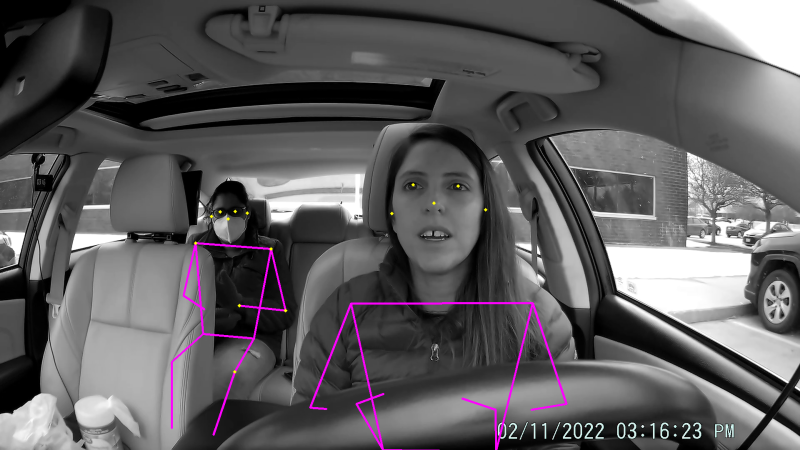
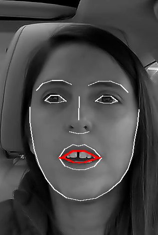
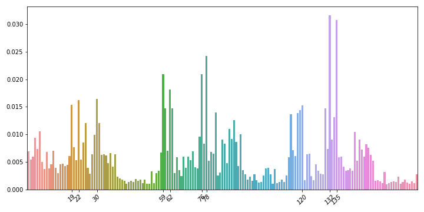

# Key Point-Based Naturalistic Driving Action Recognition (KNDAR)

This project includes our solution for Track 3 of the [2022 AI City Challenge](http://https://www.aicitychallenge.org/), solving the problem of naturalistic driving action recognition. Given video input from three different views of a driver inside a car (right side, dashboard, and rearview mirror cameras), we developed a method to identify one of 18 different actions the driver may be performing, including:

0. Normal forward driving
1. Drinking
2. Phone call (right)
3. Phone call (left)
4. Eating
5. Text (right)
6. Text (left)
7. Hair / makeup
8. Reaching behind
9. Adjust control panel
10. Pick up from floor (driver)
11. Pick up from floor (passenger)
12. Talk to passenger at the right
13. Talk to passenger at backseat
14. Yawning
15. Hand on head
16. Singing with music
17. Shaking or dancing with music

Pose Detection             |  Face Detection
:-------------------------:|:-------------------------:
  |  

## Method

The main idea of this work is that driver activity can be determined from the movement of key points on their body. As such, we can use a pre-trained pose estimation model to identify key points (e.g., nose, right ear, left wrist), and derive features from these key points. Features include angles between key points (e.g., angle of the segments created by nose, left ear, and left eye), distances between key points (e.g., left wrist to left hip), position information (distance from center to corner of the image), shifts between some of the current key points and the respective ones in the last key frame, and shifts between certain angles and the respective angles in the last key frame.

## <a name="installation"></a>Installation

```bash
conda create --name aic22 python=3.9.0
conda activate aic22
conda install pytorch==1.9.1 torchvision==0.10.1 cudatoolkit=10.2 -c pytorch
conda install -c conda-forge py-xgboost-gpu
git clone https://github.com/davidanastasiu/kndar.git
cd kndar
python -m pip install -r requirements.txt
-- install kapao 
git clone https://github.com/wmcnally/kapao.git
cd kapao && python data/scripts/download_models.py
cd ..
```

**Note**: for newer devices, such as the NVIDIA RTX 3090, you may use Pytorch 1.10 with cudatoolkit 11.3.
```bash
conda install pytorch==1.10.0 torchvision==0.11.0 torchaudio==0.10.0 cudatoolkit=11.3 -c pytorch -c conda-forge
```
You will also need to patch kapao/utils/general.py, replacing line 539 with the following (add the clone call)
```python
coords = coords.clone().reshape((nl, -1, 2))
```

## Dataset

Download the track 3 dataset from the [2022 AI City Challenge](http://https://www.aicitychallenge.org/). Any other data sets must follow the format exactly. In particular, labels should exist in each driver's videos directory in csv format. Alternatively, a labels text file named "`dataset_name`.txt" (e.g., A2.txt) can be added to the `labels` subdirectory in the format:
```
video_id activity_id ts_start ts_end
```

## Workflow

The KNDAR framework has 3 stages: 
1. Extract features from the input data.
2. Train or apply frame classification model on extracted features.
3. Merge classified frames into predicted action-consistent segments.

In the following, we will give an example of applying a pre-trained KNDAR model to dataset A2, and training a new model for dataset A1.

### <a name="inference"></a>Inference example

1. Optionally extract featues from the A2 dataset videos. Dataset will be written to A2-all-5-f.npz and should be similar to the already existing features/A2-all-5-f.npz. KAPAO has a measure of randomness that means the key points will not be exactly the same in each extraction, which will change our extracted features based on those key points.
    ```python
    python extract.py --dataset /path/to/A2 --view all --face --skip 5 --output-path A2-all-5-f.npz
    ```

2. Perform inference on the test set using the trained model A1-all-5-f-600-8.pkl. Results will be written to models/A1-all-5-f-600-8-result.txt. If you skipped step 1, change the dataset path to features/A2-all-5-f.npz to use the existing extracted features.
    ```python
    python test.py --test A2-all-5-f.npz --model models/A1-all-5-f-600-8.pkl --mgap 90 --minlen 350 --maxp 0.15
    ```

### <a name="inference"></a>Training example

1. Extract features from the A1 dataset videos. The labels in `labels/A1.txt` or the `csv` file labels in the video directories will be used to embed the labels and the extracted feature dataset.
    ```python
    python extract.py --dataset /path/to/A1 --view all --face --skip 5 --output-path A1-all-5-f.npz
    ```
2. Train the frame classification model. Choose one or more values for each of the `nestimators` and `max-depth` meta-parameters. If providing multiple values, separate them by comma.

    ```python
    python train.py --dataset A1-all-5-f.npz --nestimators 600 --max-depth 8 
    ```
The model will be written to models/A1-all-5-f-600-8.pkl. Additionally, several figures will be saved showing validation mean logloss, mean error, and feature importance.


3. Perform inference on the test set using the trained model. Results will be written to models/A1-all-5-f-600-8-result-test.txt.
    ```python
    python test.py --test A2-all-5-f.npz --model models/A1-all-5-f-600-8.pkl --mgap 90 --minlen 350 --maxp 0.15
    ```

## Extracted featues

Following is a list of features that are computed by KNDAR in each key frame for the driver.

### Angles
0. nose, left lower corner, left upper corner (of the image)
1. left wrist, left lower corner, left upper corner (of the image)
2. right wrist, left lower corner, left upper corner (of the image)
3. left elbow (left shoulder, left elbow, left wrist)
4. left shoulder (left elbow, left shoulder, left hip)
5. right elbow (right shoulder, right elbow, right wrist)
6. right shoulder (right elbow, right shoulder, right hip)
7. left eye, nose, right eye
8. nose, left shoulder, right shoulder
9. nose, right shoulder, left shoulder
10. nose, left ear, left eye
11. nose, right ear, right eye
12. left ear, right hip, right shoulder
13. right ear, left hip, left shoulder
14. left shoulder, right hip, right shoulder
15. right shoulder, left hip, left shoulder

### Distances

16. nose to lower left corner
17. left wrist to lower left corner
18. right wrist to lower left corner
19. nose to upper left corner
20. left wrist to upper left corner
21. right wrist to upper left corner
22. nose to left shoulder
23. nose to right shoulder
24. nose to left ear
25. nose to right ear
26. left eye to right eye
27. left ear to right ear
28. left ear to left wrist
29. right ear to right wrist
30. left elbow to left hip
31. right elbow to right hip
32. left wrist to left hip
33. right wrist to right hip

### Positions

34. relative bounding box width
35. relative bounding box height
36. relative position of bounding box center x
37. relative position of bounding box center x

### Position shifts (between current frame and last key frame)

38. nose
39. left eye
40. right eye
41. left ear
42. right ear
43. left shoulder
44. right shoulder
45. left elbow
46. right elbow
47. left wrist
48. right wrist

### Angle differences (between current frame and last key frame)

49. nose, left lower corner, left upper corner (of the image)
50. left wrist, left lower corner, left upper corner (of the image)
51. right wrist, left lower corner, left upper corner (of the image)
52. left elbow (left shoulder, left elbow, left wrist)
53. left shoulder (left elbow, left shoulder, left hip)
54. right elbow (right shoulder, right elbow, right wrist)
55. right shoulder (right elbow, right shoulder, right hip)

### Facial features [optional, only if --face parameter is invoked]

56. distance between lower part of upper lip and top part of bottom lip


## Results of the best submitted model

We submitted several results to the AIC 2022 challenge. Of all the models we submitted, the following model had the best performance on the full test set.

* all-5-f-600-8: 
    - extract features from all camera views, using keyframes every 5 frames,
    - extract both pose and facial features,
    - train an XGBoost model with 600 estimators and max tree depth of 8,
    - perform classification inference and merge key frame labels.

### Feature importances of the best model

We analized the XGBoost feature imporances for the best performing model and found the following 10 features had the highest weights among the 171 extracted features.



Dashboard View
* 19 - distance - nose to upper left corner of the image
* 22 - distance - nose to left shoulder
* 30 - distance - left elbow to left hip
Rearview Mirror View
* 59 - angle - right wrist, left lower corner, left upper corner of the image 
* 62 - angle - right elbow (right shoulder, right elbow, right wrist)
* 76 - distance - nose to upper left corner
* 78 - distance - right wrist to upper left corner
Right Side Camera View
* 120 - angle - right shoulder (right elbow, right shoulder, right hip)
* 132 - distance - right wrist to lower left corner
* 135 - distance - right wrist to upper left corner


## Execution instructions to re-create the AIC22 model and results
If you would like to just run inference using the stored datasets and model, skip the training steps or see the [inference example](#inference). Otherwise, perform the following steps in order. The steps assume you have already downloaded the Track 3 dataset from [AIC2022](http://https://www.aicitychallenge.org/2022-data-and-evaluation/). Note that results will vary slightly due to the stochastic nature of the KAPAO key point extractor.

1. Create conda environment and install required packages. See [installation instructions](#installation) above.

2. Extract featues from the videos. Datasets will be written to A1-all-f.npz and A2-all-f.npz.
    ```python
    python extract.py --dataset /path/to/A1 --view all --face --skip 5 --output-path A1-all-5-f.npz
    python extract.py --dataset /path/to/A2 --view all --face --skip 5 --output-path A2-all-5-f.npz
    ```

3. Train the frame driver action classification model. Model will be stored in models/A1-all-5-f-600-8.pkl. 
    ```python
    python train.py --dataset A1-all-5-f.npz --nestimators 600 --max-depth 8 
    ```

4. Perform inference on the test set using the trained model. Results will be written to models/A1-all-5-f-600-8-result-test.txt.
    ```python
    python test.py --test A2-all-5-f.npz --model models/A1-all-5-f-600-8.pkl --mgap 90 --minlen 350 --maxp 0.15
    ```

## Citation

If you found our work useful, please cite our paper:

```bibtex
@inproceedings{vats-aic22,
   author    = {Arpita Vats and David C. Anastasiu},
   title     = {Key Point-Based Driver Activity Recognition},
   volume    = {1},
   month     = {July},
   booktitle = {2022 IEEE Conference on Computer Vision and Pattern Recognition Workshops},
   series    = {CVPRW'22},
   year      = {2022},
   pages     = {},
   location  = {New Orleans, LA, USA},
}
```

## Future Work

Here are some ideas we thought of but did not have time to try/implement:
- Object detection, e.g., using yolov5s6 - look for cell phone, bottle, see what objects are detected, then extract features such as the distance from object center and right wrist or left wrist key points.
- Use a longer history of key frames during feature extraction.
- Improve the driver identification algorithm.
- Improve merge algorithm; specifically, it should not rely on challenge activity statistics.
